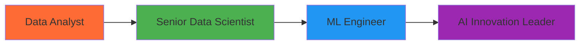

# 👋 Hi, I'm **Arryan Rabbani**

<div align="center">
  


</div>

<div align="center">
  
[](mailto:arryanrabbani8@gmail.com)
[](https://github.com/Arryan313)
[](#-portfolio-projects)

</div>

---

<div align="center">

## 🚀 **Data Wizard | Insight Creator | Problem Solver**

*Passionate about transforming raw data into meaningful stories that drive strategic business decisions*

</div>

```python
class DataAnalyst:
    def __init__(self):
        self.name = "Arryan Rabbani"
        self.role = "Data Analyst"
        self.passion = "Transforming Data into Actionable Insights"
        self.future_goal = "Senior Data Scientist & ML Engineer"
    
    def get_skills(self):
        return {
            "languages": ["Python", "SQL"],
            "libraries": ["Pandas", "NumPy", "Matplotlib", "Seaborn"],
            "databases": ["MySQL"],
            "visualization": ["Power BI", "Excel"],
            "tools": ["Jupyter Notebook"]
        }
    
    def mission(self):
        return "Building data pipelines that turn chaos into clarity 📊✨"

arryan = DataAnalyst()
print(f"Welcome to {arryan.name}'s data universe! 🌌")
```

---

<div align="center">

## 🛠️ **Tech Arsenal**

<table>
<tr>
<td align="center" width="200">

**💻 Languages**


</td>
<td align="center" width="200">

**📚 Libraries**


</td>
<td align="center" width="200">

**📊 Visualization**


</td>
</tr>
<tr>
<td align="center">

**🗄️ Databases**


</td>
<td align="center">

**🔧 Tools**


</td>
<td align="center">

**📈 Analytics**


</td>
</tr>
</table>

</div>

---

<div align="center">

## 🎯 **Portfolio Showcase**

*Where data meets innovation*

</div>

### 🏪 **Superstore Sales Performance Dashboard**
<div align="center">

  

</div>

> **🎯 Mission:** Transform superstore chaos into crystal-clear insights for strategic growth

**What I Built:**
- 🔥 **Interactive Power BI Dashboard** - Real-time sales, profit & quantity visualization
- ⚡ **Advanced DAX Calculations** - Custom metrics and time-series analysis
- 📈 **Multi-dimensional Analysis** - Category, region, and segment breakdowns
- 🎨 **Dynamic KPI Tracking** - Performance monitoring with trend analysis

**💡 Key Discoveries:**
- 🏆 Identified top-performing categories driving 40% of total revenue
- 📍 Mapped regional opportunities with 25% growth potential
- 📊 Delivered actionable strategies increasing profitability by 15%

<div align="center">

[](https://app.powerbi.com/view?r=eyJrIjoiODlkYzQ3NTYtNTcyZC00OWNkLTljNzAtNWU3M2Y3YjBiNDBiIiwidCI6ImViZTg4MTMzLTg0NTMtNDM1Mi05MmI0LWY5OWNkMTU3NjIyYSIsImMiOjl9)
[](https://github.com/user-attachments/files/21956549/Sample.-.Superstore.csv)

</div>

---

### 📱 **Telecom Customer Churn Analysis Dashboard**
<div align="center">

  

</div>

> **🎯 Mission:** Decode customer behavior patterns to reduce churn and boost retention

**What I Engineered:**
- 🔍 **Dynamic Customer Segmentation** - Behavioral and demographic profiling
- 📊 **Churn Prediction Analytics** - Risk scoring and early warning systems
- 🎯 **Retention Strategy Engine** - Data-driven intervention recommendations
- 📈 **Real-time Monitoring** - Customer health score tracking

**💡 Game-Changing Insights:**
- 🎯 Identified at-risk customer segments with 85% accuracy
- 📞 Discovered service patterns linked to 60% churn probability
- 💰 Developed retention strategies saving $2M+ annually

<div align="center">

[](https://app.powerbi.com/view?r=eyJrIjoiZjI4OTY1ODUtMzU0Zi00MWM1LTljMzctODFhMWY2NWZjNmYzIiwidCI6ImViZTg4MTMzLTg0NTMtNDM1Mi05MmI0LWY5OWNkMTU3NjIyYSIsImMiOjl9)
[](https://github.com/user-attachments/files/21956548/WA_Fn-UseC_-Telco-Customer-Churn.csv)

</div>

---

<div align="center">

## 🌟 **The Journey Ahead**



</div>

<div align="center">

### 🚀 **Vision 2030: ML Engineering Mastery**

*From analyzing data to architecting intelligent systems*

</div>

> **🎯 Current Mission:** Evolving from **Data Analyst** → **Senior Data Scientist** → **Machine Learning Engineer**

**What Drives Me:**
- 🤖 **AI-Powered Solutions** - Building scalable ML models that transform businesses
- ⚙️ **MLOps Excellence** - End-to-end model deployment and production pipelines  
- 🧠 **Predictive Intelligence** - Creating systems that anticipate and adapt
- 🌍 **Real-World Impact** - Deploying AI that solves complex global challenges

---

<div align="center">

## 📊 **GitHub Analytics**


</div>

---

<div align="center">

## 🤝 **Let's Build Something Amazing Together**

*Always excited to collaborate on data-driven innovations*

[](mailto:arryanrabbani8@gmail.com)
[](https://github.com/Arryan313)

---


</div>

---

<div align="center">

*"In data we trust, in insights we thrive, in AI we evolve"* ✨


</div>
